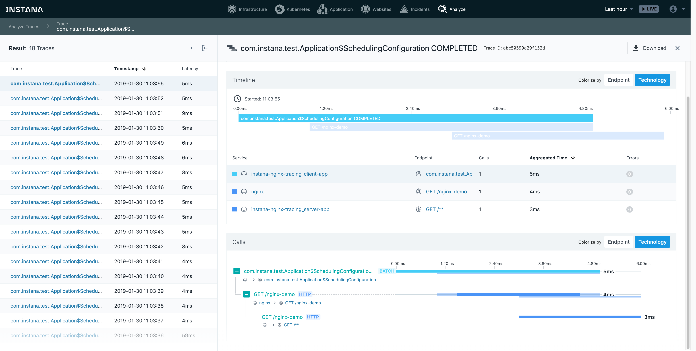

# Instana NGINX Tracing Demo

This repository contains a technology preview for Instana's [NGINX](https://www.nginx.com/) tracing functionality.

## Disclaimer

*Instana NGINX tracing is currently a technology preview.*

We reserve ourselves the right to make it better and easier before releasing the functionality for General Availability.

## Prerequisites

A `docker-compose` installation running on your machine. This demo has been created and tested on Mac OS X with `docker-compose` and `docker-machine`.

## Configure

Create a `.env` file in the root of the checked-out version of this repository and enter the following text, with the values adjusted as necessary:

```text
agent_key=<TODO FILL UP>
agent_endpoint=<local ip or remote host>
agent_endpoint_port=<443 or 4443 for local>
```

## Build

```bash
pushd client-app
./mvnw clean package
popd

pushd server-app
./mvnw clean package
popd

docker-compose build
```

## Launch

```bash
docker-compose up
```

This will build and launch

- `client-app` service, a simple Spring Boot application that issues a request every second to the ...
- `nginx` service, which routes all incoming requests to the ...
- `server-app` service, a simple Spring Boot application that returns `200` to any HTTP request.

After the agent is bootstrapped and starts accepting spans from NGINX, the resulting traces in the Analyze view will look like the following:



Naturally, all the other [NGINX capabilities of Instana](https://docs.instana.io/ecosystem/nginx/) will work out of the box as well ;-)

## Setup an Application Perspective for the Demo

The simplest way is just to assign to the agent a unique zone (the `docker-compose.yml` file comes with the pre-defined `nginx-tracing-demo` zone), and simply create the application to contain all calls with the `agent.zone` tag to have the value `nginx-tracing-demo`.
